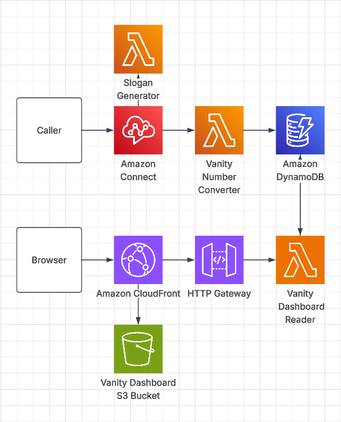

# How to use

### Dashboard
- Visit https://da4typxk42hr5.cloudfront.net
- Calls are listed from newest to oldest along with their 5 generated vanity numbers.

### Connect 
- Call 1 (213) 529-1863.
- Your top 3 vanity numbers will be read aloud to you.
- You will then be asked if you would like a slogan generated from your number.
- If yes, your new slogan will be read aloud to you.

### CDK
- Navigate to vanity-cdk folder and read instructions provided there.

# Highlights
- Automatic vanity number generator for new and repeat callers powered by Connect, Lambda, and DynamoDB.
- GSI Indexed by last call Dynamo table for fast lookups.
- Dashboard for viewing the most recent callers and their vanity numbers.
- Deploy-ready automated CDK containing all architecture and code. (Does NOT include Connect instance ARN; needs manual input)
- Fun optional slogan generator for your best fitting number.

# Design and Decisions

### Main Entry Point
- Amazon Connect is the entry point for the vanity generator. When the Connect instance is called, Connect routes to the main lambda and reads out the response generated.
- New results will only be generated if the caller doesnt have an entry in Dynamo yet. Otherwise old results will be retrieved instead.

### Main Lambda
- The call processing happens here. When a call comes through from connect, the number is read, split into fragments, and the potential letters the number can represent are matched to an included wordset. The larger the word is, the higher it will score. 1-800-BURGERS will always rank over 1-800-BURGER7 .
- The top 5 highest scoring candidates are stored in DynamoDB along with additional information including a timestamp, keyed by the callerId.
- The top 3 highest scoring candidates are read aloud back to the caller.

### Slogan Lambda
- When invoked by connect, sends an API request to Anthropic asking for a short slogan based on your vanity number.
- The slogan is then read aloud back to the caller.

### Dashboard Lambda
- Queries the VanityNumbers table's LastCalled GSI (a constant partition sorted by last-call time), returning the 5 most recent callers newest-first — no full-table scan or de-duplication needed.
- Returns the results as JSON, polling every 30s. Polling was chosen for simpler and cheaper architecture then live while not impacting function.

### Dashboard Webhost
- The dashboard is hosted as a single static HTML file in S3, with the data hooked in from an HTTP API into the dashboard Lambda. The bucket is only exposed through Cloudfront.

### Client Questions for Design
- How long should data be kept in the database history? (I went with indefinite TTL)
- How should we handle authentication? (I went with no auth for now)

### Future Improvements
- Authentication for dashboard
- In-dashboard database editor
- "Set as preffered" option for vanity numbers.